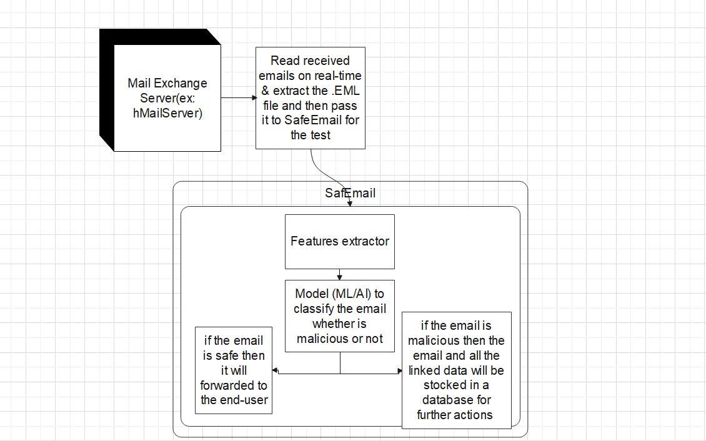

# Solution

The solution that we suggest in this repository is a tool that can be integrated with the Mail Exchange Server (hMailServer, Microsoft Exchange Server, etc..)

What this tool can do is reading an .EML file on real time before it's received by the user and do some scans on it based on Machine Learning and Artificial Intelligence to decide whatever the email is malicious or not

This tool is tied with a back-office/control panel that let a "system administrator" for example track all the blocked/detected emails and do many actions on it, like : 
 * view emails details (links, attachments, the reason why the email is blocked for).
 * report a detected email as a false positive and let it received by the user.
 * define protection rules such as: which file extensions are allowed and which aren't, enable Antivirus or disable it, archive file protected with password or not ! etc ..

### A simple global SafEmail Architecture

## This solution is for :
- Every company that manage their own mail exchange server and wish to have the ability to define some control at the received emails.
- Public mail services companies